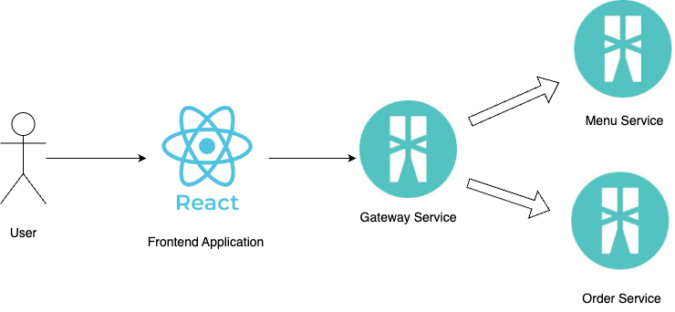

# Hotel service

This sample application contains a simple hotel management service. Users can create and view orders and food menus through a web page using this application.

This sample application containg folowing main components.
1. Frontend Application - This is a simple web application developed by React that will allow users to create and view orders and food menus.
2. Gateway Service - This is the service that will responsible for connecting front-end application with other microservices.
3. Menu Service - This service contains the API endpoints that related to the food menu of the hotel.
4. Order Service - This service contains the API endpoints that related to the order management of the hotel.

## High-level view of the System




## Prerequsites

1. Install [Ballerina](https://ballerina.io/downloads/)

2. Install [NPM](https://www.npmjs.com/get-npm)

## How to run the application

1. Clone the repository using the following command.

```bash
   git clone https://github.com/SasinduDilshara/hotel_order_service.git
```

2. Navigate to `hotel_order_service` directory.

```bash
    cd hotel_order_service
```

3.There are three services under the `hotel_order_service` directory. These are the `menu_service`, `order_service` and `gateway_service`.

3.1 Start the order_service
```bash
    cd order_service
    bal run
```

3.2 Start the menu service
```bash
    cd menu_service
    bal run
```

3.3 Start the gateway_service
```bash
    cd gateway_service
    bal run
```

4. Finally, navigate to the `hotel_order_service/webapp` directory and start the frontend application service

```
    npm i
    npm run dev
```
